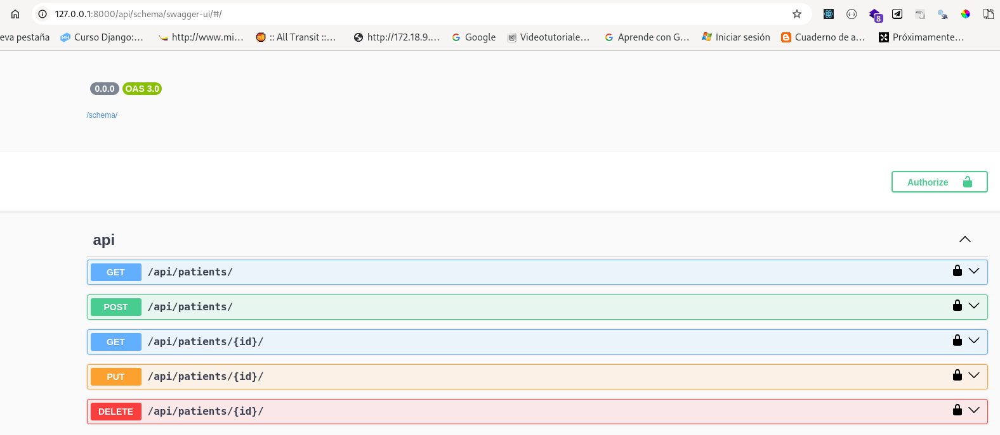
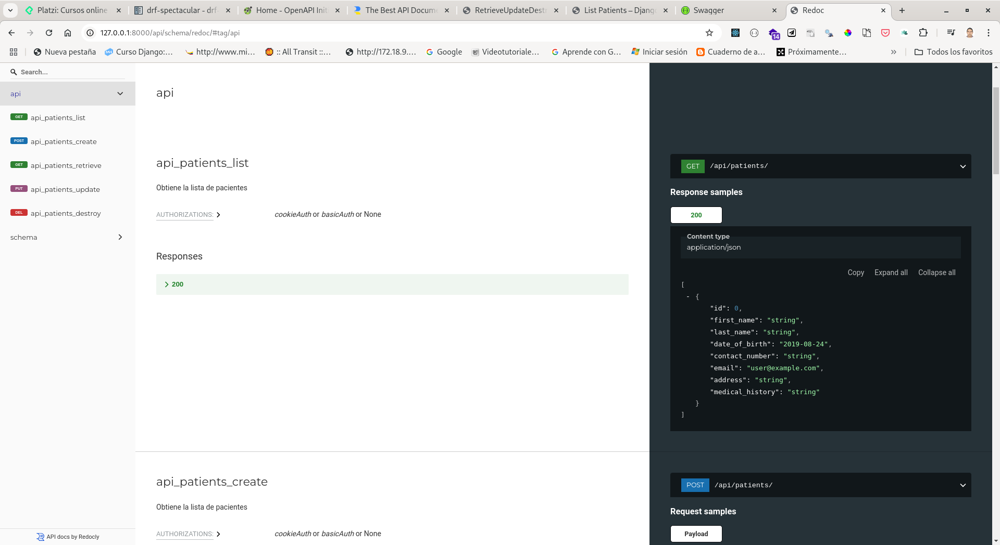

# Django Rest Framework - DRF

## Instalación
1. Crear virtualenv
```
python -m venv venv
source venv/bin/activate
```
2. Instalar dependencias
```
pip install -r requirements.txt
```
## Serializers
Los serializadores permiten que datos complejos, como querysets e instancias de modelos, se conviertan en tipos de datos nativos de Python que luego pueden ser fácilmente transformados en JSON, XML u otros tipos de contenido.


```
python manage.py shell-plus
from patients.models import Patient
from patients.serializers import PatientSerializer

data = {"first_name":"Luis","last_name":"MAtinez"}
serializer = PatientSerializer(data=data)
serializer.is_valid()
False
serializer.errors

{'date_of_birth': [ErrorDetail(string='This field is required.', code='required')], 'contact_number': [ErrorDetail(string='This field is required.', code='required')], 'email': [ErrorDetail(string='This field is required.', code='required')], 'address': [ErrorDetail(string='This field is required.', code='required')], 'medical_history': [ErrorDetail(string='This field is required.', code='required')]}
```

## Creando nuestras views

- Functions View
- APIView
- Generic Views
### Ventajas de usar Generic Views
- Reducción de código repetitivo: Implementaciones predefinidas para operaciones comunes.
- Mejora de consistencia y mantenibilidad: Aplicación de patrones uniformes en toda la API.
- Aceleración del desarrollo: Permite centrarse en la lógica específica de la aplicación.
- Facilidad de integración y extensión: Composición de comportamientos reutilizables.
- Promoción de buenas prácticas: Adherencia a los principios de diseño de Django y REST.

Toda la documentación de las generic views está disponible en la siguiente [url](https://www.cdrf.co/)

### ViewSets


## Documentación de API's
Usaremos la librería [drf-spectacular](https://www.drf-spectacular.readthedocs.io/en/latest/index.html) para generar nuestra documentación de API's.
```
pip install drf-spectacular
```
Luego de configurada la librería drf-spectacular, esta nos permite generar la documentación con el estándar [OpenAPI](https://www.openapis.org/). Podemos acceder a la documentación de la API desde el navegador, tanto con swagger como con redoc.

### Documentación de la API con Swagger


### Documentación de la API con Redoc
